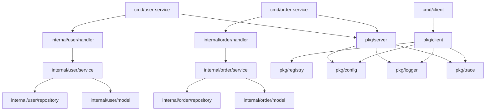

# RPC框架架构优化文档

## 项目结构优化

根据Golang最佳实践，我们对项目结构进行了重大优化，将业务代码和系统代码进行了清晰分离。

## 新的项目结构

```
rpc2/
├── cmd/                           # 应用程序入口点
│   ├── user-service/             # 用户服务启动程序
│   │   └── main.go
│   ├── order-service/            # 订单服务启动程序  
│   │   └── main.go
│   └── client/                   # 客户端测试程序
│       ├── main.go
│       ├── user_client.go
│       └── order_client.go
├── internal/                     # 私有应用和库代码（不可被外部导入）
│   ├── user/                     # 用户服务业务逻辑
│   │   ├── model/               # 领域模型
│   │   │   └── user.go
│   │   ├── repository/          # 数据访问层
│   │   │   └── user_repository.go
│   │   ├── service/             # 业务逻辑层
│   │   │   └── user_service.go
│   │   └── handler/             # gRPC处理器层
│   │       └── user_handler.go
│   ├── order/                   # 订单服务业务逻辑
│   │   ├── model/
│   │   │   └── order.go
│   │   ├── repository/
│   │   │   └── order_repository.go
│   │   ├── service/
│   │   │   └── order_service.go
│   │   └── handler/
│   │       └── order_handler.go
│   ├── interceptor/             # gRPC拦截器（系统级）
│   │   └── trace.go
│   └── middleware/              # 中间件（系统级）
│       └── middleware.go
├── pkg/                         # 可被外部应用使用的库代码
│   ├── client/                  # RPC客户端框架
│   ├── server/                  # RPC服务端框架
│   ├── registry/                # 服务注册发现
│   ├── config/                  # 配置管理
│   ├── logger/                  # 日志系统
│   └── trace/                   # 链路追踪
├── api/                         # API定义文件
│   └── proto/                   # protobuf定义
│       ├── user/                # 用户服务API
│       │   └── user.proto
│       ├── order/               # 订单服务API
│       │   └── order.proto
│       └── common/              # 通用API
│           └── hello.proto
├── configs/                     # 配置文件
│   └── app.yaml
├── examples/                    # 示例和演示代码（保留原有示例）
└── docs/                        # 文档
```

## 架构分层说明

### 1. 应用层 (cmd/)
- **职责**: 应用程序的入口点，负责初始化和启动服务
- **特点**: 每个服务都有独立的启动程序
- **优势**: 支持独立部署和扩展

### 2. 业务逻辑层 (internal/)
采用经典的分层架构模式：

#### Handler层 (handler/)
- **职责**: gRPC接口处理，协议转换
- **功能**: 
  - 处理gRPC请求和响应
  - 协议数据转换（proto ↔ domain model）
  - 错误处理和状态码映射

#### Service层 (service/)
- **职责**: 核心业务逻辑
- **功能**:
  - 业务规则验证
  - 业务流程编排
  - 跨领域服务协调

#### Repository层 (repository/)
- **职责**: 数据访问抽象
- **功能**:
  - 数据持久化接口定义
  - 不同存储实现（内存、数据库等）
  - 数据访问逻辑封装

#### Model层 (model/)
- **职责**: 领域模型定义
- **功能**:
  - 业务实体定义
  - 业务规则封装
  - 领域逻辑实现

### 3. 框架层 (pkg/)
- **职责**: 可复用的系统组件
- **特点**: 可被外部项目引用
- **组件**: 客户端、服务端、注册中心、配置、日志、追踪

### 4. API定义层 (api/)
- **职责**: 服务接口定义
- **组织**: 按服务模块分类
- **版本**: 支持API版本化管理

## 优化优势

### 1. 清晰的关注点分离
- **业务逻辑** vs **系统逻辑** 分离
- **接口层** vs **实现层** 分离
- **领域模型** vs **传输模型** 分离

### 2. 高内聚低耦合
- 每个服务模块独立封装
- 层次间通过接口交互
- 依赖注入支持测试

### 3. 可测试性提升
- 每层都可独立单元测试
- 接口抽象便于Mock
- 业务逻辑与框架解耦

### 4. 可维护性增强
- 代码组织更加清晰
- 职责边界明确
- 便于代码审查和重构

### 5. 可扩展性提升
- 新增服务模块简单
- 支持不同存储实现
- 便于功能模块插拔

## 服务启动方式

### 启动用户服务
```bash
cd cmd/user-service
go run main.go
```

### 启动订单服务
```bash
cd cmd/order-service  
go run main.go
```

### 启动客户端测试
```bash
cd cmd/client
go run *.go                 # 测试所有服务
go run *.go user           # 仅测试用户服务  
go run *.go order          # 仅测试订单服务
```

## 依赖关系



## 最佳实践体现

1. **标准Go项目布局**: 遵循 https://github.com/golang-standards/project-layout
2. **依赖倒置原则**: Service层依赖Repository接口而不是具体实现
3. **单一职责原则**: 每层、每个模块职责单一明确
4. **开闭原则**: 通过接口扩展，对修改关闭
5. **接口隔离原则**: 定义最小化接口，避免臃肿接口

这种架构设计使得项目更易维护、测试和扩展，符合现代微服务架构的最佳实践。